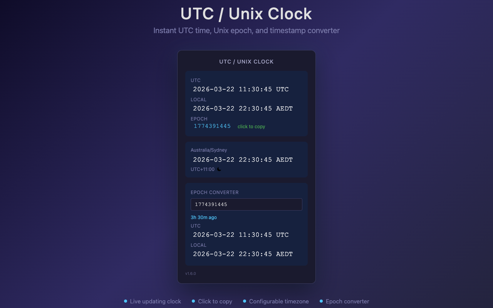

# UTC/Unix Clock — Chrome Extension

A minimal Chrome extension that shows the current UTC time and Unix epoch at a glance. Includes a configurable second timezone and a built-in epoch converter.



## Why?

**Database timestamps are Unix epochs.** When debugging production data or querying databases that store timestamps as integers, you need the current epoch *right now* — not after googling "unix timestamp converter" for the hundredth time.

**Incident reports need both UTC and local time.** Writing a post-mortem at 2am and need to reference "the alert fired at 14:32 UTC (01:32 AEDT)"? This extension shows both side by side, updating live.

**Got a timestamp from a log?** Paste it into the epoch converter to instantly see the UTC and local time — no need to leave the browser.

## Features

- **Live UTC + Local clock** — current date and time in both UTC and local, updates every second. Click either to copy
- **Unix epoch** — click to copy to clipboard instantly
- **Second timezone** — configurable dropdown (default: Sydney). Click to copy. Day/night indicator. Handy for distributed teams
- **Epoch converter** — paste any Unix timestamp (seconds) to see it as UTC and local time with relative time (e.g. "3h 30m ago"), click either result to copy
- **Settings panel** — click the gear icon to configure:
  - **Dark / Light theme** — switch between dark and light mode
  - **12h / 24h time format** — choose between 24-hour and 12-hour (AM/PM) display
  - **Date format** — pick from YYYY-MM-DD, DD/MM/YYYY, or MM/DD/YYYY
  - All preferences are saved and persist across sessions

## Install

### From GitHub Releases

1. Go to the [latest release](https://github.com/zhongdai/chrome-utc-now/releases/latest)
2. Download the `.zip` file
3. Unzip to a folder
4. Open `chrome://extensions`, enable **Developer Mode**
5. Click **Load unpacked** → select the unzipped folder

### Build from Source

```bash
git clone git@github.com:zhongdai/chrome-utc-now.git
cd chrome-utc-now
npm install
npm run build
```

1. Open `chrome://extensions`
2. Enable **Developer Mode** (top-right toggle)
3. Click **Load unpacked** → select the `dist/` folder

## Development

Requires Node.js 20+.

```bash
npm install          # install dependencies
npm test             # run all tests
npm run lint         # eslint
npm run build        # build to dist/
npm run package      # build + zip
```

Run a single test file:

```bash
npx jest src/time.test.ts --verbose
```

## CI/CD

- **CI** (`.github/workflows/ci.yml`): lint + test + build on every push/PR to `main`
- **Release** (`.github/workflows/publish.yml`): on push to `main`, auto-tags from `package.json` version and creates a GitHub Release with the packaged zip attached

To publish a new release, bump the version in both `package.json` and `src/manifest.json`, then push to `main`.

## License

MIT
